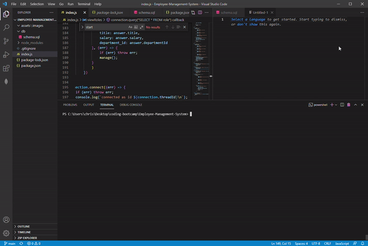
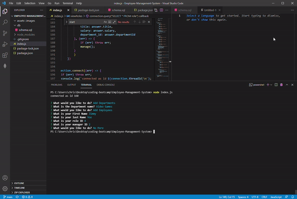

# Employee Management System 

  ## Description 
  A way to track employees

  ## Table of Contents
  * [Installation](#installation)
  * [Usage](#usage)
  * [License](#license)
  
  ## Installation
  run npm i, then node index.js

  ## Usage 
  Manage Employees

  ## License
  This product uses a MIT license

  ## Demo
  
  

  ## Questions
  For additional questions feel free to contact: chrischo2012@gmail.com
  GitHub: https://github.com/chrischo94
  